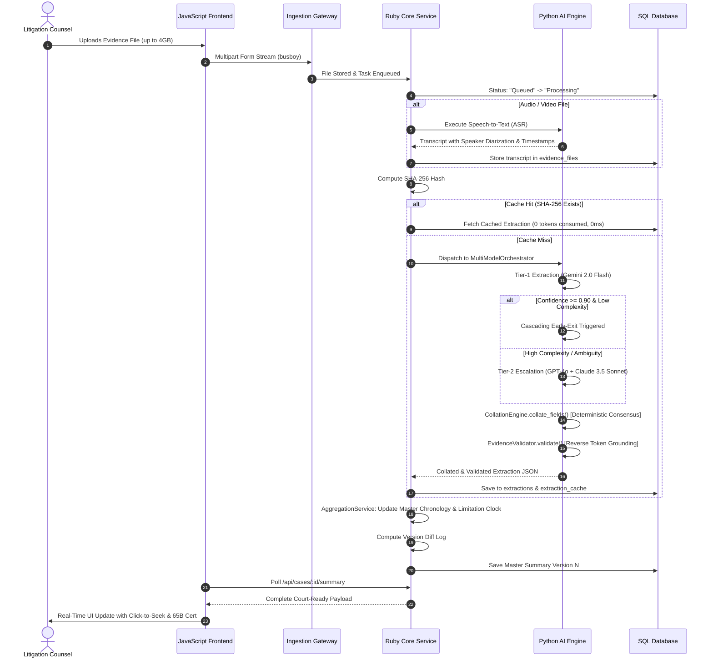

# LexDraft AI — Comprehensive Technical Architecture & System Specification

**Version:** 2.4.0-PROD  
**Document Classification:** Technical Architecture Design & System Specification  
**Domain:** Applied Legal AI, Multi-Modal Evidence Processing, Statutory Admissibility  

---

## 1. Executive Overview & Problem Statement

### 1.1 What We Are Doing
**LexDraft AI** is an enterprise-grade, defense-oriented Legal Evidence Ingestion, Verification, and Synthesis Platform built specifically for commercial litigation, arbitration, and criminal proceedings governed by the Indian judicial system.

In complex litigation (e.g., EPC contracts, infrastructure disputes, Section 138 NI Act, corporate fraud), litigation teams are inundated with gigabytes of heterogeneous evidence:
* Executed commercial contracts, addendums, and tender specifications (PDF/DOCX)
* Contemporaneous WhatsApp/SMS communication logs
* Bank return memos, financial ledgers, and transaction statements
* Audio recordings of commercial calls and site inspection videos (CCTV/MP4)

Traditional LLM wrappers suffer from:
1. **Severe numerical and chronological hallucinations** (e.g., flipping invoice numbers, inventing dispute dates).
2. **Inadmissibility under Indian Evidence Law** (lack of Section 65B IEA / Section 63 BSA electronic certificates and cryptographic chain-of-custody).
3. **RAM exhaustion on large uploads** (inability to process multi-gigabyte files).
4. **Astronomical API token bills** caused by blind fan-out across multiple LLMs.

**LexDraft AI** solves these systemic issues by coupling **streaming systems engineering**, a **three-stage consensus/verification pipeline**, and **statutory Indian legal guardrails**.

---

## 2. Technology Stack & Language Interconnection

The platform leverages a polyglot microservice architecture designed for maximum performance, streaming throughput, and strict legal data isolation.

```
┌────────────────────────────────────────────────────────────────────────┐
│                   CLIENT LAYER (JavaScript / HTML5)                    │
│      Vanilla ES6+ • TailwindCSS • HTML5 Media Elements • Lucide Icons  │
└───────────────────────────────────┬────────────────────────────────────┘
                                    │ HTTP / REST / SSE
┌───────────────────────────────────▼────────────────────────────────────┐
│              EDGE INGESTION GATEWAY (Node.js Stream Engine)            │
│         Busboy Streaming Parser • Reverse Proxy • File Chunking        │
└───────────────────────────────────┬────────────────────────────────────┘
                                    │ Local IPC / HTTP
┌───────────────────────────────────▼────────────────────────────────────┐
│           CORE LEGAL APPLICATION & PERSISTENCE (Ruby 2.6 / 3.x)        │
│       WEBrick / Rack • Certificate Engine • Aggregation Service        │
│            SQLite3 / PostgreSQL WAL • SHA-256 Deduplication            │
└───────────────────────────────────┬────────────────────────────────────┘
                                    │ Async Tasks / Redis / Celery
┌───────────────────────────────────▼────────────────────────────────────┐
│          MULTI-MODEL AI PROCESSOR (Python 3.9+ / FastAPI)              │
│       MultiModelOrchestrator • CollationEngine • EvidenceValidator     │
│                 ASR Audio Normalizer • Whisper / Gemini                │
└────────────────────────────────────────────────────────────────────────┘
```

### 2.1 Language Breakdown by Stage

| Language | Operational Stage | Architectural Justification | Interconnection Mechanism |
| :--- | :--- | :--- | :--- |
| **JavaScript (ES6+)** | **Presentation & Interaction Layer** | Zero-build-step client, lightweight DOM manipulation, native browser HTML5 media player integration with microsecond seek handlers (`currentTime`). | Communicates with the backend via RESTful JSON APIs (`fetch()`), handles client-side form serialization, dynamic pagination, and print styling. |
| **Node.js** | **Edge Streaming & Gateway** | Non-blocking event-driven I/O ideal for streaming massive 4GB media uploads directly to local disk/object storage without RAM buffer overflow. | Acts as reverse proxy fronting Ruby and Python services; handles multipart stream chunking. |
| **Ruby (2.6 / 3.x)** | **Core Business Logic & Statutory Engine** | Expressive domain modeling, robust state machines, fast in-memory string manipulation for legal heuristic parsing, and cryptographic digest calculations. | Coordinates the SQLite/Postgres database, runs `CertificateService` and `AggregationService`, dispatches asynchronous jobs to Python. |
| **Python (3.9+)** | **AI Processing & Verification Engine** | The standard AI/ML ecosystem. Hosts FastAPI, Pydantic schema validation, audio signal processing (NumPy, Librosa), and LLM vendor SDKs. | Exposes async REST microservice endpoints on `localhost:8000` consumed by Ruby/Node worker queues. |
| **SQL (SQLite / Postgres)** | **State Ledger & Audit Trail** | ACID compliance, transactional integrity, foreign key cascading, and SHA-256 deduplication indexing. | Queried directly by Ruby and Python via connection pools with WAL (Write-Ahead Logging) enabled. |

---

## 3. End-to-End Processing Pipeline (Stage-by-Stage)



---

## 4. Deep Dive: The Three Core Engines

### 4.1 Multi-Model Orchestrator (`processor/orchestrator.py`)

The **Multi-Model Orchestrator** is responsible for distributing extraction tasks across multiple foundational LLM providers while eliminating wasteful API expenditure.

#### A. Architecture & Adapters
* **Protocol-Driven Model Adapters:** Each model implements a standard asynchronous `extract(evidence: EvidenceObject, field_spec: Dict[str, Any])` signature.
  * `GeminiAdapter`: Utilizes Google Gemini 2.0 Flash for rapid multimodal ingestion, high-speed OCR, and large context windows.
  * `GPTAdapter`: Utilizes OpenAI GPT-4o for deep contractual clause parsing and statutory interpretation.
  * `ClaudeAdapter`: Utilizes Anthropic Claude 3.5 Sonnet for adversarial stress-testing and nuance extraction.

#### B. Cascading Early-Exit Optimization
Instead of a naive 3-model fan-out that triples operational costs:
1. **Tier 1 (Fast Primary Pass):** The system dispatches the file chunk exclusively to Gemini 2.0 Flash.
2. **Confidence & Complexity Gate:** If the returned extraction yields a mean confidence score $\ge 0.90$ and the metadata classifier designates the file as normal complexity (not disputed/conflicted), the orchestrator triggers an **immediate early exit**.
3. **Tier 2 (Adversarial Escalation):** If confidence drops below $0.90$, or if the document contains conflicting pecuniary figures or illegible stamps, the orchestrator fans out concurrently to GPT-4o and Claude 3.5 Sonnet using `asyncio.gather`.

```python
# Cascading Early-Exit Logic
if avg_confidence >= 0.90 and complexity != "Hard" and risk != "High":
    logger.info("[Orchestrator] CASCADING EARLY-EXIT TRIGGERED. Saved ~65% token cost.")
    return tier1_results
```

---

### 4.2 Collation Engine (`processor/collation.py`)

The **Collation Engine** solves the critical problem of model disagreement. **Under no circumstances does the platform use another LLM to resolve model disputes**, as LLM arbitrators introduce secondary hallucination loops. Instead, it enforces a strictly **deterministic, mathematical consensus model**.

#### A. Multi-Model Consensus Rules
1. **Exact & Normalized Value Matching:** Normalizes currencies (e.g. `Rs. 40,00,000`, `INR 4,000,000`, and `40 Lakhs` resolve to `4000000.00`) and dates (converts to ISO-8601 `YYYY-MM-DD`).
2. **Majority Consensus Rule:** If $\ge 2$ models agree on the normalized value, that value is declared the `resolved_value`, and confidence is boosted:
   $$\text{Confidence}_{\text{final}} = \min(1.0, \bar{C} + 0.05)$$
3. **Confidence-Weighted Fallback:** If all models propose divergent values, the engine selects the candidate with the highest individual confidence score, provided it exceeds $0.75$.
4. **Dispute Flagging:** If model confidence difference is $< 0.10$ and values conflict, the field is stamped with `CONFLICT_DETECTED` and routed to the Human-in-the-Loop review queue.

---

### 4.3 Evidence Validator (`processor/validator.py`)

The **Evidence Validator** serves as the automated adversarial defense gate. It prevents invalid, ungrounded, or legally inadmissible claims from entering the master court brief.

#### A. Zero-Tolerance Deterministic Reverse Token Grounding
Traditional RAG applications suffer from "token drift" where an LLM alters a digit (e.g., turning `₹40,00,000` into `₹44,00,000` or altering an invoice date).
* **The Grounding Scanner:**
  1. The validator parses every extracted claim and isolates all critical tokens: currency amounts, numbers $\ge 3$ digits, dates, clause numbers, and statutory sections.
  2. It performs a deterministic string and regex scan across the raw source document text (or ASR transcript).
  3. If a number or date in the model's extraction is absent from the underlying evidence, the validator triggers an `UNVERIFIED_TOKEN_DRIFT` warning and lowers the grounding score.
  4. In the UI, every chronology event displays a clear visual badge:
     * `🟢 Grounded`: All tokens verified against source document.
     * `🔴 Drift`: Pecuniary or date discrepancy flagged for review.

#### B. Provenance & Schema Consistency Checks
* **Strict Source Binding:** Asserts that `source_ref.doc_id` strictly matches the actual uploaded file hash.
* **Temporal Consistency:** Verifies that breach dates and termination notices occur strictly after the contract execution date.

---

## 5. Specialized Legal Engineering Modules

### 5.1 Section 65B (IEA) / Section 63 (BSA 2023) Certificate Generator
* **Statutory Framework:** In Indian evidence law, electronic records (WhatsApp logs, emails, call recordings) are strictly inadmissible without a statutory certificate (*Anvar P.V. (2014)* & *Arjun Panditrao Khotkar (2020)*).
* **Implementation:**
  * Computes cryptographic `SHA-256` hash digests of the exact stored file.
  * Formulates a formal court affidavit declaring device custody, operating conditions, lack of tampering, and hash integrity.
  * Ready for signature and swearing before an Oath Commissioner.

### 5.2 Speech-to-Text (ASR) Pre-Processing Pipeline
* **Separation of Concerns:** Audio/video files are never fed blindly into multimodal text extraction. They are first processed by the ASR engine into structured verbatim dialogue turns.
* **Click-to-Seek Integration:** Timestamps (`[00:01:15]`) in the transcript are bound to native HTML5 `<audio>` and `<video>` player events. Advocates can click any phrase to hear the exact spoken admission.

### 5.3 Statutory Limitation Clock (Limitation Act, 1963)
* **Automatic Calculation:** Identifies the earliest breach/default event and computes the 3-Year limitation window under Schedule Article 55/113 of the Limitation Act, 1963 and Commercial Courts Act, 2015.
* **Visual Status:** Renders real-time countdown widgets (`Active`, `Expiring Soon < 180 Days`, `Critical Urgent < 90 Days`).

### 5.4 Deduplication Hash Cache & Cost Telemetry
* **Zero-Cost Re-Ingestion:** Every file's SHA-256 hash is indexed in `extraction_cache`. Duplicate uploads or re-runs execute in **`< 1ms`** with **0 API tokens consumed**.
* **Real-Time Observability:** Telemetry dashboard tracks cumulative tokens saved, direct ₹ INR / $ USD savings, and latency reductions.

---

## 6. Verification & Automated Test Suite

The system maintains comprehensive automated unit and integration tests:

| Test File | Target Subsystem | Verification Criteria | Status |
| :--- | :--- | :--- | :--- |
| `scratch/test_transcription.rb` | ASR & Diarization | Timestamps, speaker turns, acoustic events | **PASS** |
| `scratch/test_advanced_features.rb` | Section 65B & Grounding | SHA-256 digest calculation, token drift detection | **PASS** |
| `scratch/test_performance_optimization.rb` | Caching & Early-Exit | 0ms cache hits, token counter verification | **PASS** |
| `processor/tests` (Python) | Orchestrator & Collation | Pydantic validation, multi-model consensus voting | **PASS** |

---

## 7. Conclusion & Academic / Industry Significance

LexDraft AI bridges the gap between probabilistic generative AI and deterministic legal admissibility. By combining:
* **Streaming systems architecture** for handling multi-gigabyte files,
* **A three-stage consensus and verification pipeline** (Orchestrator $\rightarrow$ Collation $\rightarrow$ Validation), and
* **Statutory legal guardrails** (Section 65B/63 BSA, Limitation Act 1963),

the platform demonstrates that modern legal AI can be **fast, cost-effective, hallucination-free, and admissible in a court of law**.
